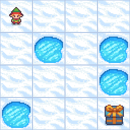
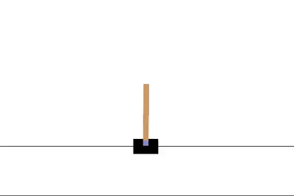
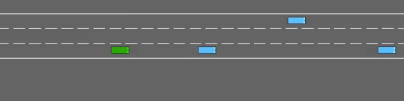

# Deep Q-Learning & Reinforcement Learning Projects

## Overview
This project explores the development and training of reinforcement learning (RL) agents in three diverse OpenAI Gym environments: **FrozenLake**, **CartPole**, and **Highway-env**. Each environment presents unique challenges that test the capabilities of RL algorithms such as Deep Q-Learning (DQN), Proximal Policy Optimization (PPO), and others.

## Environments

### 1. FrozenLake

FrozenLake is a grid-based environment where the agent must navigate across a slippery, frozen surface to reach the goal while avoiding holes. The slippery nature of the lake adds stochasticity to the agent’s movement, requiring careful planning and value estimation to find an optimal path.

- **Objective**: Safely navigate from the starting point to the goal while avoiding holes.
- **State Space**: Discrete, grid-based representation of the lake.
- **Action Space**: Four directional actions—left, right, up, down.
- **Key Challenge**: Navigating on the slippery surface introduces uncertainty, making movement unpredictable and requiring robust decision-making strategies.

### 2. CartPole

CartPole is a classic control problem where the agent must learn to balance a pole on a moving cart. The agent receives continuous observations about the system’s state, such as the cart's position, velocity, pole angle, and angular velocity, and must apply forces to keep the pole upright.

- **Objective**: Prevent the pole from falling by controlling the cart’s movement.
- **State Space**: Continuous observations including cart position, velocity, pole angle, and angular velocity.
- **Action Space**: Two possible actions—move the cart left or right.
- **Key Challenge**: Maintaining balance requires precise control, with increasing difficulty as the pole remains balanced for longer periods.

### 3. Highway-env

Highway-env simulates a driving scenario where the agent controls a vehicle navigating through highway traffic. The agent must learn to change lanes, maintain safe distances, and avoid collisions while optimizing speed.

- **Objective**: Drive safely at high speeds while avoiding collisions and managing interactions with other vehicles.
- **State Space**: Continuous observations of the vehicle’s surroundings, including lane markings and the positions of nearby vehicles.
- **Action Space**: Actions include acceleration, deceleration, and lane changes.
- **Key Challenge**: Complex dynamics of interacting with other vehicles, balancing safety, speed, and efficiency.

## Project Objectives
- **Develop RL agents** capable of mastering each environment.
- **Compare various RL algorithms**, including Deep Q-Learning (DQN) and Proximal Policy Optimization (PPO), across the three environments.
- **Implement reward shaping** and curriculum learning techniques to enhance training efficiency and agent performance.

## Results and Analysis
- **FrozenLake**: The agent successfully navigated the frozen lake while adapting to the stochastic nature of its slippery surface.
- **CartPole**: The agent demonstrated effective control strategies, balancing the pole for a consistent number of time steps before failure.
- **Highway-env**: The agent achieved high speeds while maintaining safety and avoiding collisions, effectively handling the complex interactions with other vehicles.